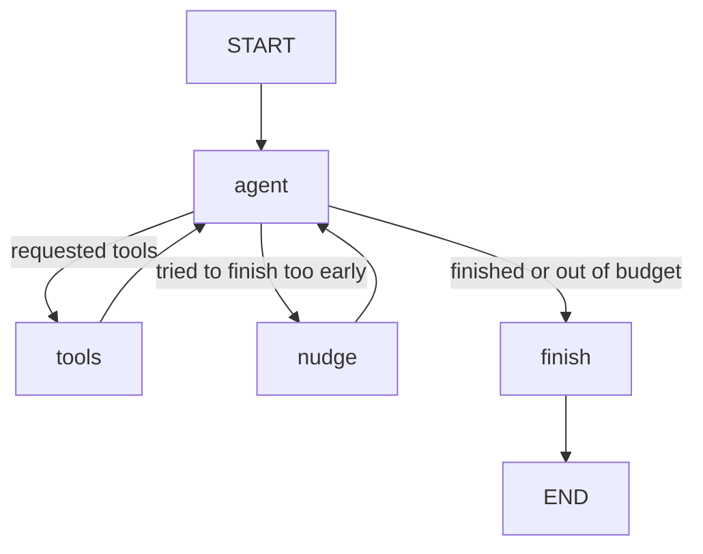
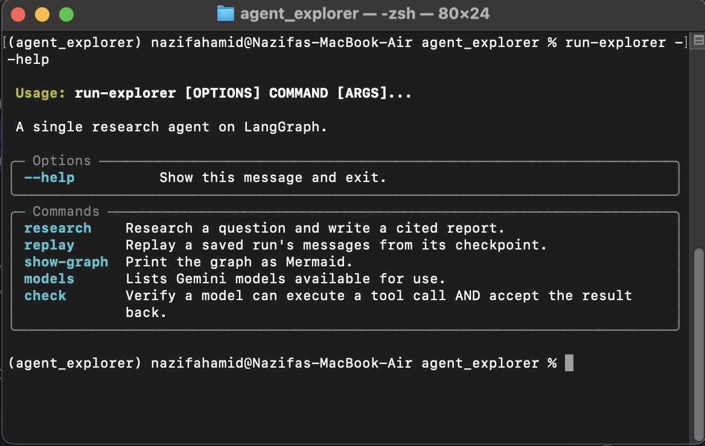

# explorer

A research agent built on LangGraph. Given a question, it searches the web,
fetches the pages, takes notes with source attribution and writes a cited
report. It shows every decision made along the way.

```
run-explorer research "How do free LLM API tiers compare in 2026?"

```


explorer is a research agent with four tools at its disposal (set_plan, web_search,
fetch_page, save_note). LLM takes the non-deterministic actions of handling tasks that require judgement: 

```
- How to divide the question into sub-questions.
- What to search for.
- Which facts are worth saving.
- When enough evidence has been collected.
- Synthesizingand writing the final report. 

```

The graph binds it with constraints to stop it from:

```
- Exceeding the turn budget.
- Repeatedly fetching the same URL.
- Keep searching while pages remain unread.
- Finishing without saved notes.
- Exiting while planned sub-questions remain uncovered.

```

## Lessons

### Decide which behaviours are suggestions and which must be complied

During the first run the model was only prompted to save notes from each page. Although it understood the rule, several turns later it was neglected. Further prompting only improved little. Enforcing note-taking in the graph solved the problem. Therefore, if there's a rule that genuinely matters, it has to be put in the control flow

### LLMs do not reliably hold a sense of position or state 

Conversation history contained the number of urls it fetched, pages it read and the turns completed but the model did not reliably notice or put them together to keep track of its progress. In one run, out of 12 turns it spent all 12 only web searching, reading nothing and producing nothing. I then put a small progress block that gets rebuilt every turn: current turn, remaining budget, notes saved, pages read, unread urls, plan coverage and the useful next action. Bookkeeping had to be coded in the workflow constraints to make it more dependable.

### Constraints do not ensure research quality:

The graph made sure every plan number had a note but cannot prove the plan was good or the note saved was the most useful. Plan coverage improved reliability but worked as only a structural check. A better research system would check source diversity, note relevance and whether the original plan represents the question well.

## How it works

The graph contains four nodes and one routing decision:



The shared state contains:

- `question`: the original research question.
- `plan`: two to four sub-questions created by the model.
- `messages`: the conversation and tool-call history.
- `notes`: small, durable facts with source URLs.
- `candidates`: URLs returned by searches.
- `visited`: URLs that have already been fetched.
- `steps`: the number of model turns used.
- `nudges`: how many premature answers the graph rejected.
- `report`: the final result.

### The agent node

On every turn, the agent receives the system instructions, a freshly generated
progress summary, and the message history. The tools are attached with
`bind_tools(TOOLS)`, which gives the model their names, descriptions, and argument
schemas.

The model can then return either ordinary prose or structured tool calls such as:

```python
{
    "name": "fetch_page",
    "args": {"url": "https://example.com"},
}
```

The model chooses the tool and its arguments. The graph does not prescribe a fixed
search sequence, although the prompt advises:

```text
set_plan → web_search → fetch_page → save_note
```

### The tool node

`run_tools()` reads the latest model message and processes every requested tool call:

```python
last = state["messages"][-1]

for call in last.tool_calls:
    ...
```

The functions in `tools.py` perform the external operations and return text.
`run_tools()` owns their effects on graph state:

```text
set_plan   → replace the plan
web_search → add result URLs to candidates
fetch_page → add the URL to visited
save_note  → add a structured note
```

Keeping these responsibilities separate makes the workflow easier to test. A tool
does not secretly mutate graph state, and every state change passes through one
visible boundary.

The tool node also enforces several constraints before or after execution:

- An unknown tool becomes an error message instead of crashing the run.
- A previously visited URL is not fetched again.
- A second search can be blocked when enough unread results are already available.
- Tool failures are returned to the model as observations.
- A successful page fetch includes an immediate reminder to save useful facts.
- Questions containing words such as `current`, `latest`, `today`, or a year receive
  a default recency filter if the model omitted one.

The current recency heuristic is deliberately simple: every matched word defaults to
the past year. This is safe enough to avoid completely stale results, but it is not
precise—`today` should ideally map to a day rather than a year.

### Routing and enforcement

After every agent turn, `should_continue()` selects the next node:

```python
if last.tool_calls:
    return "finish" if state["steps"] >= max_steps else "tools"

if finish_blocker(state) and budget_remains:
    return "nudge"

return "finish"
```

If the model requests tools, the graph normally runs them. If the model returns prose,
the graph treats that as an attempt to finish and checks two conditions:

1. Has at least one note been saved?
2. Does every planned sub-question have a note tagged against it?

If either check fails and budget remains, the `nudge` node adds a specific correction
to the conversation and returns control to the agent. It names the missing
sub-questions rather than merely saying “try again.”

If the step budget is exhausted, the `finish` node forces an ending. It normally uses
the model's final prose. If the latest response was still a tool call, it invokes a
model without tools and asks it to write from the saved notes. This guarantees that a
model which keeps requesting tools cannot loop forever.

## Running it


