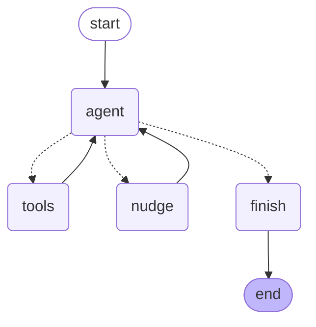

# agent_explorer

A research agent built on LangGraph. You give it a question, and it searches the web,
reads the pages it finds, takes notes with sources attached, and writes you a cited
report. Along the way it shows you every decision it made.

```
run-explorer research "How do free LLM API tiers compare in 2026?"
```

## Why I built it

I wanted to understand how AI agents actually work, and I don't think you can learn
that from reading about them. So I set myself a constraint: every part of the control
flow had to be something I could point at and explain.

LangGraph takes care of the bookkeeping — passing state between steps, accumulating
the conversation, saving checkpoints. What it deliberately doesn't do is make any
decisions for you. The state schema, the routing rules, the tools, the prompts, the
strategy for not drowning in text: all of that is the actual project, and it fits in
about 500 lines.

This is the first half of a two-part plan. Phase 1, which is what you're looking at,
is a single agent working alone. Phase 2 will break it into several agents — a
planner, some searchers, a writer, a critic — and this whole agent becomes one node in
that larger graph. Starting with one agent was deliberate. Building a multi-agent
system on top of an agent you don't understand just gives you a bigger thing you don't
understand.

## How it works

The graph has three working parts and one decision point.



The **agent** node calls the language model with the tools attached. The **tools** node
runs whatever the model asked for and folds the results back into state. The **nudge**
node pushes back when the agent tries to stop before it has really finished. And
**finish** produces the report.

Everything hangs off one function, which is the entire control flow of a single agent:

```python
def should_continue(state, max_steps, max_nudges):
    last = state["messages"][-1]
    if last.tool_calls:
        return "finish" if state["steps"] >= max_steps else "tools"
    if finish_blocker(state) and budget_remains(state):
        return "nudge"
    return "finish"
```

The agent has four tools. `set_plan` breaks the question into two to four
sub-questions and is meant to be called first. `web_search` looks things up through
Google, Brave, or DuckDuckGo, whichever responds. `fetch_page` downloads a page and
strips out the navigation and adverts. `save_note` records one fact, where it came
from, and which sub-question it helps answer.

The state deserves a mention because a lot of the design lives there. Alongside the
conversation, it holds the plan, the notes, the URLs already read, the URLs found but
not yet read, and a couple of counters. Notes are kept separate from the conversation
on purpose: web pages are enormous and disposable, whereas notes are small, permanent,
and carry their sources with them. That separation is what lets the agent research for
a dozen turns without its context filling up with raw HTML.

## What I learned

The interesting part of this project wasn't the code. It was watching real runs fail
in ways I hadn't anticipated, and working out what each failure was really about.

**Prompts ask, graphs enforce.** The very first proper run searched the web twelve
times, read two pages, saved zero notes, and produced a report saying it had no facts
to report. It had followed my instruction — "never state a fact you didn't save as a
note" — to the letter, having saved nothing. I rewrote the prompt to be clearer about
note-taking, which helped a little. What actually fixed it was changing the graph so
that it refuses to finish when the notes list is empty and sends the agent back to
work instead. This turned out to be the single most useful idea in the project. If
something genuinely matters, a rule in the system prompt is a suggestion the model
will drift away from twelve turns later. Put it in the control flow and it becomes a
fact of the world.

**An agent needs to know where it is.** Once I looked closely at why searching was so
attractive on every single turn, the answer was that the agent had no idea it was on
turn eight of twelve. Each turn it received the same instructions and a longer
transcript, and decided what to do from scratch. Searching is cheap and always feels
like progress, whereas reading a page is expensive and commits you to something. So it
searched. I now rebuild a small progress block every turn and append it to the system
prompt — how many turns are left, how many notes exist, how many search results are
sitting unread, and one line of what to do next. It never accumulates in the
conversation, so it costs nothing, and it changed the agent's behaviour more than any
prompt rewrite did.

**Models research by confirming what they already believe.** This one bothered me most.
Asked which AI models lead on reasoning benchmarks, the agent's first search was
`AI models complex reasoning benchmark leaders o1 DeepSeek R1 Claude 3.5`. Nobody had
mentioned those models — they were simply the leaders as of the model's training
cutoff, so it went looking for them. Pages about them exist, so the search succeeds,
notes get written, and you receive a confident report describing a world that has since
moved on. The failure is completely invisible in the output; you can only see it in the
query. The system prompt now tells the agent plainly that its knowledge has a cutoff
and that when a question is about the present it should search the category and the
timeframe rather than the names it remembers. The graph also fills in a recency filter
when the question is clearly about now and the model didn't set one, which it never did
on its own.

**Whatever you measure is what you get.** After I added the plan and made the graph
refuse to finish while any sub-question had no notes against it, the next run produced
exactly one note per sub-question, all three drawn from a single blog post, and stopped.
The coverage check read a satisfying "3 of 3". The research was one article written by a
company that sells API access. I hadn't asked for depth or for independent sources, so I
didn't get them. This is worth internalising before you start adding metrics to an
agent: it will find the cheapest way to satisfy whatever you check, and the cheapest way
is rarely what you meant.

**Honesty and usefulness pull against each other.** I tried making the report get built
purely from the saved notes, so that a fact the agent never wrote down could not
possibly appear in the output. It worked exactly as designed and the reports became
much thinner, because notes are lossy summaries and the model writes far better when
the pages it read are still in front of it. I reverted it. The version in the repo lets
the model write the report itself, which means the citations are looser than I'd like.
Checking claims against notes is really a second agent's job, and that's a Phase 2
problem.

**Most of the hard debugging was other people's software.** Gemini's OpenAI-compatible
endpoint silently drops a signature field its own thinking models require, so tool
calls work on the first turn and fail on the second. Model IDs turned out not to be
guessable, with `gemini-3-flash` returning a 404 while `gemini-3.6-flash` is real. The
newest model has the smallest free quota, so the friendliest-sounding name is the worst
one to use. And a daily quota rejection arrives with a "retry in 58 seconds" hint that
will have you retrying forever. None of this is agent theory, and all of it cost more
time than the agent logic did.

## Running it

You'll need Python 3.11 or newer, [uv](https://github.com/astral-sh/uv), and a free API
key from [z.ai](https://z.ai), which takes an email address and no card.

```bash
uv venv && source .venv/bin/activate
uv pip install -e ".[dev]"
cp .env.example .env     # then paste your ZAI_API_KEY in
```

Before anything else, check that your model can actually do a tool loop:

```bash
run-explorer check
```

This sends two turns rather than one, and the second turn is the point. A single call
only proves the model can ask for a tool. Providers that mangle tool history fail when
you send the results back, which is the second turn, and that is where Gemini's
compatibility endpoint falls over. A one-turn check told me everything was fine
moments before a real run died.

Then:

```bash
run-explorer research "your question here"
run-explorer research "..." --model local --max-steps 20
run-explorer replay <run-id>       # step back through a saved run
run-explorer models                # list Gemini models your key can use
run-explorer show-graph            # print the graph as Mermaid
```

Reports are saved to `runs/`, and every run is checkpointed so you can replay it.

There are three model backends, and switching between them is a flag. `glm` is the
default and runs GLM-4.7-Flash through z.ai's free tier. `gemini` uses Google's native
client rather than their OpenAI-compatible endpoint, for the reason described above.
`local` talks to Gemma 4 running under llama-server on your own machine, which is
slower but has no quota at all. Start that with `--jinja`, or tool calls arrive as
ordinary prose and the loop never fires.

## Testing

```bash
pytest        # 57 tests, no API key or network needed
ruff check .
```

The whole graph is tested against a scripted fake model, so the tests need no API key,
touch no network, and run in under a second. That's only possible because the routing
logic and the tool execution are plain functions that take state and return state
rather than closures buried inside the graph, and it is probably the most useful thing
I did for my own sanity while debugging.

One detail worth stealing if you build something similar: `add_messages` deduplicates
by message ID, so a fake model that hands back the same message object twice will
silently replace the earlier one instead of appending. That produced two test failures
that looked exactly like graph bugs and weren't.

## What's next

Phase 2 splits this into several agents: a planner that decomposes the question,
searchers that work on sub-questions in parallel, a writer, and a critic that checks
whether the claims are actually supported and whether anything was missed. This agent
becomes the searcher, which is the payoff of having built a single agent properly
first.

The gaps that Phase 2 should close are the ones the traces exposed. Nothing currently
checks whether the plan itself is any good, and enforcing coverage of a badly framed
plan is worse than not enforcing it at all. Nothing checks whether the report's claims
are supported by the notes. And nothing pushes the agent towards independent sources,
which is how it ended up citing a single interested party. All three are recognisably a
critic's job.

See [PLAN.md](PLAN.md) for the fuller design, and [README.md.bkup](README.md.bkup) for
a much longer version of this document with more of the implementation detail.

## Built with

[LangGraph](https://langchain-ai.github.io/langgraph/) for orchestration,
[ddgs](https://pypi.org/project/ddgs/) for search,
[trafilatura](https://trafilatura.readthedocs.io/) for pulling readable text out of web
pages, [Typer](https://typer.tiangolo.com/) and [Rich](https://rich.readthedocs.io/)
for the command line, and [llama.cpp](https://github.com/ggml-org/llama.cpp) for
running models locally.

MIT licensed.
